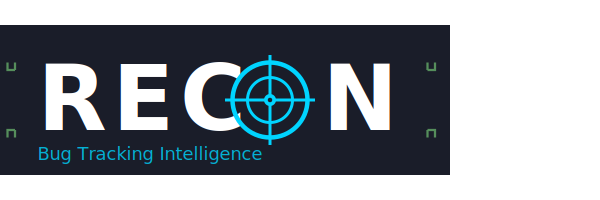
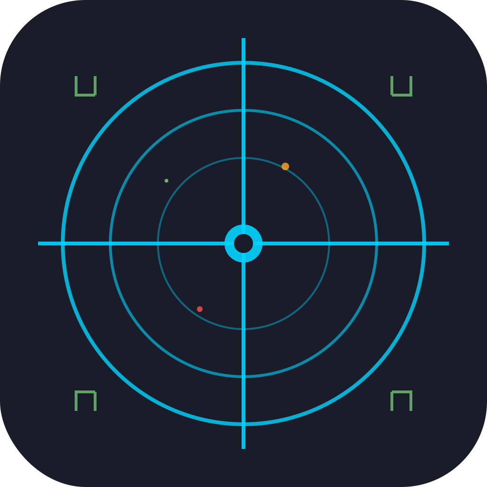

<div align="center">
  

  <h3>Bug Tracking Intelligence</h3>
  <p><em>Your Personal Shield Against "He Said, She Said."</em></p>
</div>

<h3>Bug Tracking Intelligence</h3>
<p><em>Your Personal Shield Against "He Said, She Said."</em></p>

Ever reported a critical bug, only to be told weeks later that it "slipped through the cracks"? Are you tired of the blame game during crunch time, where verbal agreements and scattered notes aren't enough to prove what was said?

Recon is a personal defect and accountability tracker built for the tester on the front lines. It's designed to be your single source of truth a private, undeniable log of every bug, every conversation, and every decision. Stop relying on memory and start relying on data.

## The Core Problem

In fast-paced teams without a centralized project management tool, vital information gets lost.

- Verbal commitments from developers are forgotten.
- Key decisions made in passing are never documented.
- The burden of proof falls unfairly on the tester.

## Recon was built to solve this

### Features

Recon is more than just a notebook. It's a professional-grade tool designed for speed and clarity.

- **Detailed Bug Tracking**: Log bugs with all critical fields - Severity, Priority, Status, Assignee, Environment, Steps to Reproduce, and deadline management.

- **The Sacred Timeline**: The key feature. Every bug gets an interactive timeline where each conversation and decision becomes a timestamped event, creating a visual history of the bug's life.

- **Nexus Events**: Flag critical updates (like "Won't Fix" decisions) as "Nexus Events" that branch off the main timeline with visual indicators.

- **Tap-to-Reveal**: Clean interface design. Tap any timeline event to reveal full details in tooltips.

- **CSV Export**: Export bug reports to CSV format for analysis and reporting.

- **Deadline Notifications**: Set deadline reminders with advance warnings. Never miss important deadlines.

- **Offline-First**: Built with local database using SQLite. Fast performance with or without internet connection. Your data stays secure on your device.

### Who is Recon for?

**QA Testers & Engineers** who need precise bug tracking and accountability documentation.

**Software Engineers** who want a personal log for assigned bugs with deadline management.

**Project Managers** in teams who need lightweight but comprehensive issue tracking with visual timelines.

**Independent Developers** who need systematic quality assurance tracking.

### The Roadmap

**Coming Next:**

- [ ] **Image & Video Attachments**: Add visual proof to timeline events
- [ ] **Analytics Dashboard**: Bug trend analysis and reporting
- [ ] **Team Collaboration**: Share bug reports and timelines with team members
- [ ] **Cloud Sync**: Optional secure backup and cross-device synchronization

---

## Quick Start

1. **Clone the Repository**

   ```bash
   git clone https://github.com/atharvdange618/Recon.git
   cd Recon
   ```

2. **Install Dependencies**

   ```bash
   npm install
   ```

3. **Deploy to Device**
   ```bash
   npm start
   # Scan QR code with Expo Go or use development build
   ```

## Core Architecture

- **Database**: SQLite with WAL mode for performance
- **State Management**: Zustand for state control
- **Animations**: React Native Reanimated + Skia for timeline graphics
- **Notifications**: Expo Notifications for deadline alerts
- **File System**: Expo FileSystem for CSV export

---

<div align="center">
  
### Built With

**React Native** • **Expo SDK 53** • **SQLite** • **Skia Graphics** • **TypeScript**

**Local-First Architecture** • **Cross-Platform** • **High Performance**



**Recon v1.0** - _Bug Tracking Intelligence_

</div>
